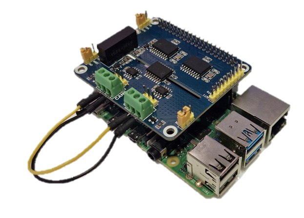

# CAN Bus Vehicle Emulator
This project emulates a vehicle's Controller Area Network (CAN) bus using a Raspberry Pi and a Simulink model. It is designed to simulate a simple automotive system and send realistic CAN messages for development, testing, or educational purposes. The emulator also includes a dashboard for interfacing with the simulated vehicle state in real-time.

## Features

- Real-time CAN message generation.
- Dashboard UI within external mode control.

## Requirements
- Raspberry Pi with Simulink support package for Raspberry Pi librarys/packages installed.
- Simulink Vehicle Network Toolbox
- Waveshare 2CH CAN HAT (installation instructions on their website)

## Installation

- Ensure hardware is setup, with both CAN channels enabled
- Download FYP.slx
- Connect the host PC and Raspberry Pi to the same WiFi network
- Open FYP.slx in Simulink, press the "Hardware Settings"  button, then press the "Target hardware resources" button. Ensure the IP address is correct with the Raspberry Pi's current IP address.
- Press "Monitor & Tune" in Simulink. 
- The model will then compile, which may take a while.
- Open the Panel to access the UI of the emulator. 

## Extra Files

- Waveform Folder - Contains data of a waveform oscilioscope reading, a MATLAB script for post-processing and the Simulink model used for CAN frame generation while the oscilioscope was connected.
- battCurveConvert.m - File used to transform cell data into a form which can be used by Simulink.
- LICENSE - MIT License for publication.
- readmeimage.png - Image used at the top of this page.